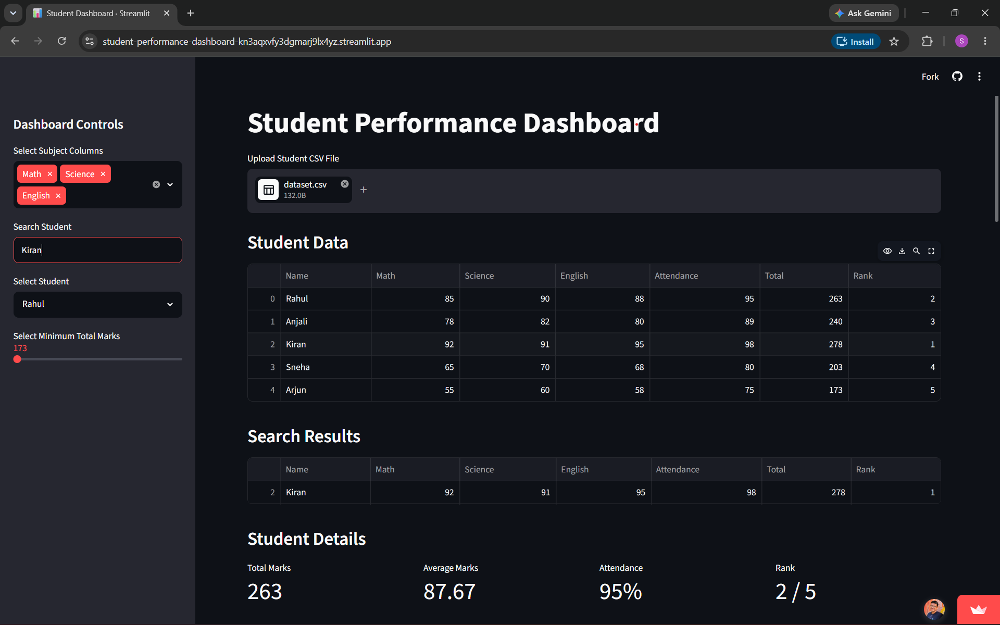
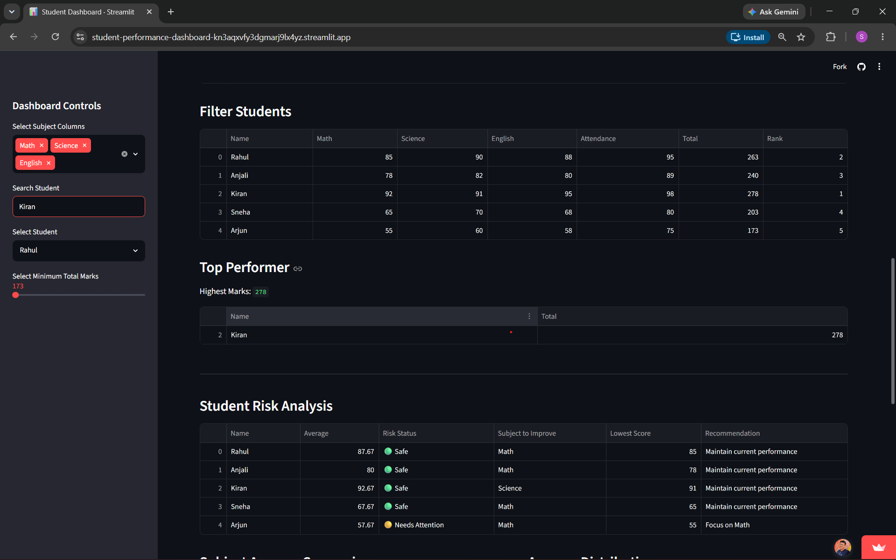
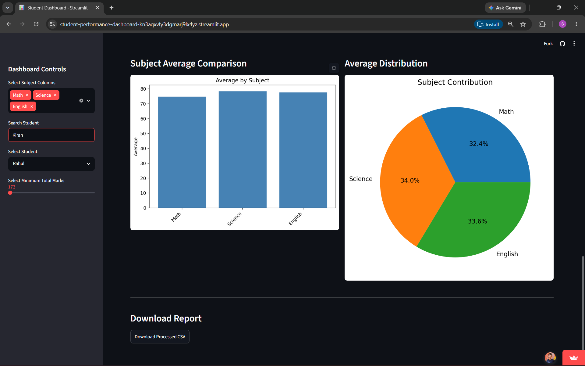

# 🎓 Student Performance Dashboard


[](https://student-performance-dashboard-kn3aqxvfy3dgmarj9lx4yz.streamlit.app)

A dynamic Student Performance Analytics Dashboard built using Python, Pandas, Streamlit, and Matplotlib.

## 🚀 Live Demo

https://student-performance-dashboard-kn3aqxvfy3dgmarj9lx4yz.streamlit.app

## 📸 Screenshots

### Dashboard Overview



### Risk Analysis



### Charts and Analytics


## 📌 Project Overview

This dashboard helps analyze student academic performance through interactive visualizations, ranking, risk analysis, and personalized recommendations.

Users can upload a CSV file containing student records and instantly view insights about student performance.

## ✨ Features

- Upload CSV datasets
- Student search functionality
- Student ranking system
- Top performer identification
- Risk analysis and recommendations
- Subject-wise average calculation
- Interactive filters
- Bar chart visualization
- Pie chart visualization
- Download processed reports

## 🛠 Technologies Used

- Python
- Pandas
- Streamlit
- Matplotlib
- Git
- GitHub
- Streamlit Community Cloud

## 📊 Dashboard Modules

### Student Data
Displays all student records with calculated totals and rankings.

### Student Search
Search students by name and view filtered results.

### Student Details
Shows:
- Total Marks
- Average Marks
- Attendance
- Class Rank

### Performance Recommendation
Provides recommendations based on the student's weakest subject.

### Top Performer
Identifies students with the highest total marks.

### Student Risk Analysis
Classifies students into:
- Safe
- Needs Attention
- High Risk

### Visualizations
- Subject Average Comparison (Bar Chart)
- Average Distribution (Pie Chart)

### Report Export
Download processed student data as CSV.

## 📂 Dataset Format

Example:

| Name | Math | Science | English | Attendance |
|--------|--------|--------|--------|--------|
| Rahul | 85 | 90 | 88 | 95 |
| Kiran | 92 | 91 | 95 | 98 |

## 🖥️ Installation

Clone the repository:

```bash
git clone https://github.com/Srishanth-45/student-performance-dashboard.git
cd student-performance-dashboard
```

Install dependencies:

```bash
pip install -r requirements.txt
```

Run the application:

```bash
streamlit run app.py
```

## 👨‍💻 Author

Srishanth Samala

GitHub:
https://github.com/Srishanth-45

## 📄 License

This project is licensed under the MIT License - see the [LICENSE](LICENSE) file for details.