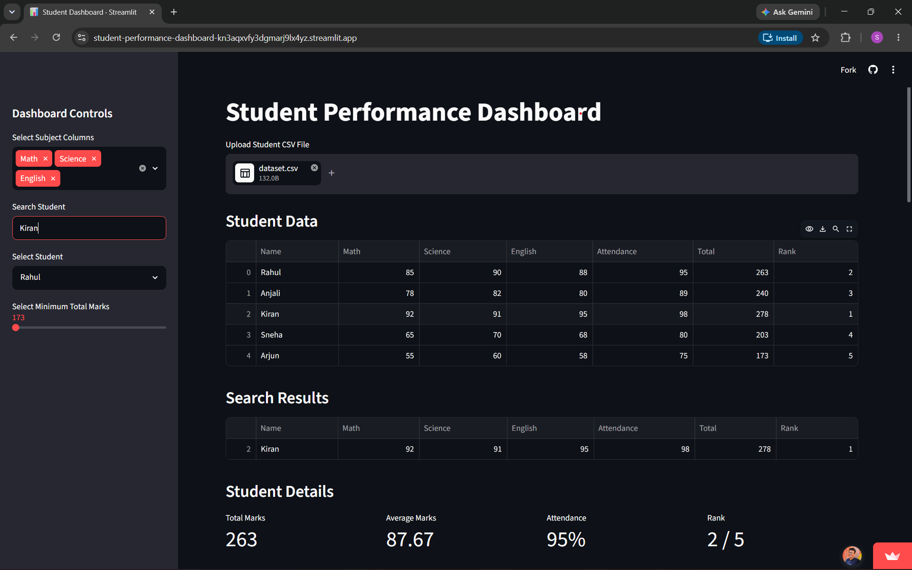
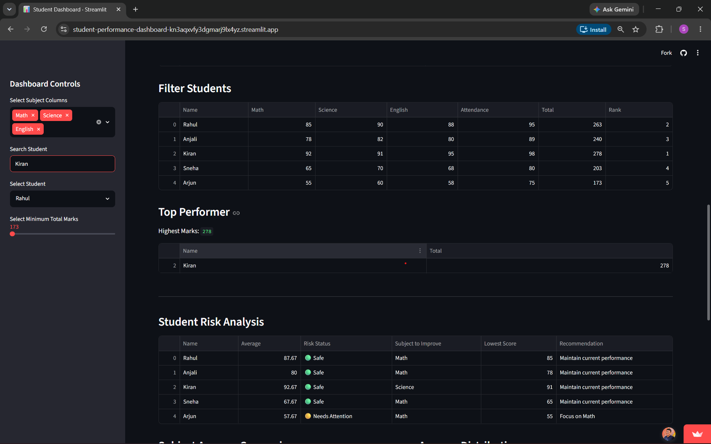
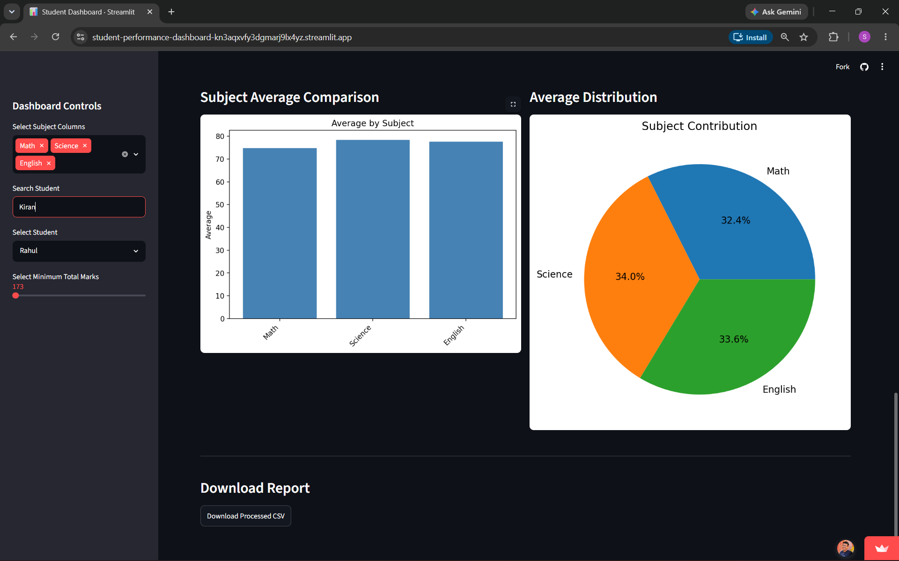

# 🎓 Student Performance Dashboard


[](https://student-performance-dashboard-kn3aqxvfy3dgmarj9lx4yz.streamlit.app)

A dynamic and interactive **Student Performance Analytics Dashboard** built using Python, Pandas, Streamlit, and Matplotlib.

The dashboard allows users to upload student datasets and analyze academic performance through rankings, filtering, risk analysis, recommendations, and interactive visualizations.

---

## 🚀 Live Demo

[Open the Student Performance Dashboard](https://student-performance-dashboard-kn3aqxvfy3dgmarj9lx4yz.streamlit.app)

---

## 📸 Screenshots

### Dashboard Overview



### Risk Analysis



### Charts and Analytics



---

## 📌 Project Overview

The Student Performance Dashboard helps analyze academic performance using an uploaded CSV dataset.

It automatically processes the dataset and provides useful insights such as:

- Student totals and averages
- Class rankings
- Subject-wise performance
- Top performers
- Student risk levels
- Personalized performance recommendations
- Interactive filtering
- Data visualizations

The dashboard is designed to work with different student datasets and automatically detect numeric subject columns.

---

## ✨ Features

- 📂 Upload CSV datasets
- 🔎 Search students by name
- 👨‍🎓 Select individual students
- 🔢 Handle duplicate student names
- 🏆 Student ranking system
- 🥇 Top performer identification
- ⚠️ Student risk analysis
- 💡 Performance recommendations
- 📊 Subject-wise average calculation
- 🎚️ Minimum total marks filter
- 📈 Bar chart visualization
- 🥧 Pie chart visualization
- 📋 Interactive student tables
- 💾 Download processed reports
- 🔄 Dynamic subject detection

---

## 🛠 Technologies Used

- Python
- Pandas
- Streamlit
- Matplotlib
- Git
- GitHub
- Streamlit Community Cloud

---

## 📊 Dashboard Modules

### Student Data

Displays student records with their subject marks, calculated totals, and rankings.

### 🔎 Student Search

Search students by name and view matching search results.

Search and student selection are independent functionalities.

### 👨‍🎓 Student Details

Displays details for the selected student:

- Total Marks
- Average Marks
- Attendance
- Class Rank

### 💡 Performance Recommendation

Identifies the student's weakest subject and provides a recommendation for improvement.

### 🏆 Top Performer

Identifies the student with the highest total marks.

### ⚠️ Student Risk Analysis

Classifies students into:

- Safe
- Needs Attention
- High Risk

The analysis also identifies areas where students may need improvement.

### 📈 Visualizations

The dashboard provides:

- Subject Average Comparison — Bar Chart
- Average Distribution — Pie Chart

The visualizations update according to the selected subject columns.

### 🎚️ Student Filtering

Students can be filtered using the **Minimum Total Marks** slider.

### 💾 Report Export

Processed student data can be downloaded as a CSV file.

---

## 📂 Dataset Requirements

The dashboard accepts CSV files containing student records.

### ⚠️ Required `Name` Column

The CSV file **must contain a column named `Name`**.

The `Name` column is used to identify students throughout the dashboard.

For example:

```csv
Name,Maths,Science,English,Attendance
Rahul,85,90,88,95
Kiran,92,91,95,98
Arjun,75,82,85,90
